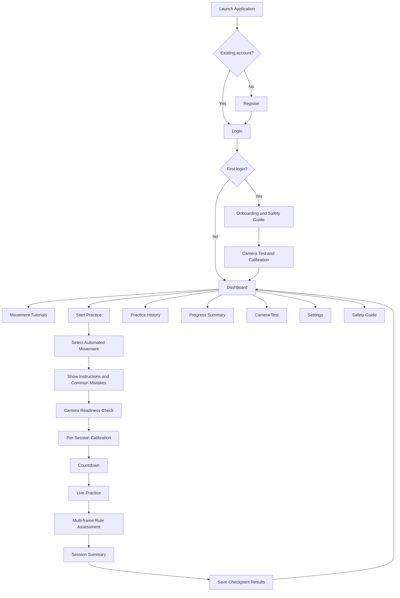
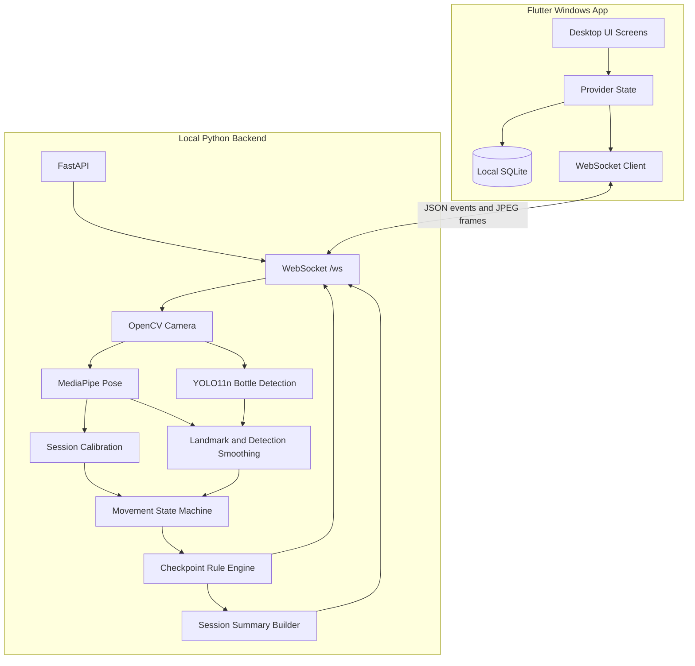

# ELIXR Development Plan

## 1. Project Positioning

ELIXR is a **Windows desktop beginner practice assistant**, not a full AI flairtending instructor.

The system will:

- show guided tutorials;
- detect whether one user and one practice bottle are visible;
- estimate body landmarks using MediaPipe Pose;
- detect the approximate bottle location using YOLO11n;
- assess selected beginner preparation and bottle-control movements using explicit rules;
- provide simple feedback such as `Passed`, `Needs Improvement`, or `Unable to Assess`;
- save local practice history and checkpoint results.

The system will **not claim** to verify exact finger grip, bottle rotation, contact, balance, catch quality, or advanced flair-trick correctness.

> Core rule: if the system cannot explain exactly how a movement becomes `Passed` or `Failed`, that movement must not receive automated assessment.

---

## 2. Current State

The workspace is a fresh Flutter Windows project with the default counter demo in [`lib/main.dart`](lib/main.dart). The current file contains syntax problems and should be replaced completely.

Current development status:

- no completed custom Flutter interface;
- no local database;
- no Python backend;
- no webcam pipeline;
- no tested movement rules;
- no technical benchmark;
- no validated scoring model.

Because development has not started, the first task is **not** building a polished dashboard. The first task is proving that one movement can be detected and assessed consistently.

---

## 3. Final Technology Decisions

| Area | Final decision |
|---|---|
| Platform | Flutter Windows desktop application |
| Interface | Flutter with desktop sidebar navigation |
| Local storage | SQLite using `sqflite_common_ffi` |
| CV backend | Local Python FastAPI server |
| Live communication | WebSocket on `127.0.0.1` |
| Camera owner | Python/OpenCV only |
| Body landmarks | MediaPipe Pose |
| Bottle detection | Pretrained Ultralytics YOLO11n, COCO `bottle` class |
| Hand model | Not required for the MVP; optional experiment only |
| Assessment | Rule-based, normalized, multi-frame state machines |
| Result format | Checkpoint results; no unsupported skill percentage |
| User roles | One local role: `Trainee` |
| Cloud | Out of scope |

Do not mix these choices with Supabase, Firebase, YOLO Pose, mobile deployment, or custom model training in the same MVP plan.

---

## 4. Realistic System Flow



---

## 5. Target Architecture



### Development workflow

```bash
# Terminal 1: Python backend
cd backend
uvicorn main:app --host 127.0.0.1 --port 8000

# Terminal 2: Flutter Windows app
flutter run -d windows
```

Do not use `--reload` during final performance testing because it adds development overhead.

---

## 6. Repository Layout

```text
elixr_application/
├── lib/
│   ├── main.dart
│   ├── app.dart
│   ├── core/
│   │   ├── constants/
│   │   │   ├── app_constants.dart
│   │   │   ├── movement_catalog.dart
│   │   │   └── websocket_constants.dart
│   │   ├── router/app_router.dart
│   │   ├── theme/app_theme.dart
│   │   └── widgets/
│   ├── data/
│   │   ├── database/
│   │   │   ├── database_helper.dart
│   │   │   └── migrations.dart
│   │   ├── models/
│   │   │   ├── user.dart
│   │   │   ├── practice_session.dart
│   │   │   ├── session_check.dart
│   │   │   └── movement.dart
│   │   └── repositories/
│   ├── services/
│   │   ├── auth_service.dart
│   │   ├── practice_service.dart
│   │   ├── session_service.dart
│   │   └── websocket_service.dart
│   └── features/
│       ├── auth/
│       ├── onboarding/
│       ├── dashboard/
│       ├── camera_test/
│       ├── tutorials/
│       ├── movements/
│       ├── practice/
│       ├── session_summary/
│       ├── history/
│       ├── progress/
│       ├── safety/
│       └── settings/
├── backend/
│   ├── main.py
│   ├── requirements.txt
│   ├── config.py
│   ├── api/
│   │   ├── health.py
│   │   └── websocket.py
│   ├── vision/
│   │   ├── camera.py
│   │   ├── bottle_detector.py
│   │   ├── pose_detector.py
│   │   ├── geometry.py
│   │   └── smoothing.py
│   ├── assessment/
│   │   ├── calibration.py
│   │   ├── movement_state.py
│   │   ├── rule_engine.py
│   │   ├── session_summary.py
│   │   └── rules/
│   │       ├── ready_stance.py
│   │       ├── balanced_stance_hold.py
│   │       ├── basic_bottle_hold.py
│   │       ├── front_bottle_lift.py
│   │       ├── side_bottle_lift.py
│   │       ├── bent_arm_preparation.py
│   │       ├── arm_extension.py
│   │       ├── controlled_bottle_lowering.py
│   │       ├── hand_to_hand_transfer.py
│   │       └── toss_preparation.py
│   ├── schemas/
│   │   ├── commands.py
│   │   ├── frame_event.py
│   │   └── session_result.py
│   └── tests/
│       ├── test_geometry.py
│       ├── test_state_machine.py
│       └── test_rules.py
├── assets/
│   ├── tutorials/
│   ├── safety/
│   └── branding/
└── README.md
```

Use a feature-first Flutter structure and plain Python modules. Do not add unnecessary domain layers, dependency injection frameworks, or microservices.

---

## 7. Flutter Dependencies

| Package | Purpose |
|---|---|
| `sqflite_common_ffi` | SQLite support on Windows |
| `path` / `path_provider` | Safe local database path |
| `web_socket_channel` | Local real-time connection |
| `provider` | Authentication and practice state |
| `go_router` | Route management and auth redirect |
| `intl` | Date and duration formatting |
| `fl_chart` | Simple progress charts |
| `crypto` | Salted local password hashing for the prototype |

Use `CupertinoApp` only if the team can keep desktop behavior usable. A desktop layout matters more than forcing a mobile-looking interface.

### Security limitation

The local account system is for prototype access separation only. Do not describe it as production-grade authentication. No raw password may be stored.

---

## 8. UI Theme and Navigation

### Theme tokens

| Token | Value |
|---|---|
| Background | `#0D0D0F` |
| Card surface | `#1A1A1F` |
| Primary accent | `#FF4D8D` |
| Secondary accent | `#FF7EB3` |
| Text primary | `#F5F5F5` |
| Text secondary | `#A0A0A8` |
| Success | `#6EE7B7` |
| Warning | `#FBBF24` |
| Error | `#FF6B6B` |

### Main sidebar

- Dashboard
- Tutorials
- Start Practice
- Camera Test
- History
- Progress
- Safety Guide
- Settings
- Logout

Login, registration, and onboarding screens do not use the sidebar.

---

## 9. Feature Screens

| Screen | Required content |
|---|---|
| **Launch / Splash** | Check database, backend status, and saved user session |
| **Register** | Full name, username, password, confirm password, dominant hand |
| **Login** | Username and password; clear errors only |
| **Onboarding** | Purpose, limitations, camera placement, safety rules |
| **Dashboard** | Total sessions, last movement, completed checkpoints, quick actions |
| **Tutorials** | Step guide, demonstration media, common mistakes, safety notice |
| **Camera Test** | Camera selector, body visibility, bottle visibility, lighting guidance, approximate FPS |
| **Movement Selection** | Ten automated assessments plus tutorial-only advanced moves |
| **Practice** | Live frame, movement step, bottle/body status, checkpoint feedback, timer, stop button |
| **Session Summary** | Final status, attempts, passed checks, failed checks, interruptions, recommendations |
| **History** | Previous sessions with filters and checkpoint details |
| **Progress** | Completed sessions, success count per movement, common failed checkpoints |
| **Safety Guide** | Plastic practice bottle, clear space, no glass, stop when tired or in pain |
| **Settings** | Dominant hand, camera, mirror mode, overlay, sound, reset onboarding, delete history |

Do not show a global leaderboard, fake rank, or unsupported improvement percentage.

---

## 10. Automated Assessment Catalog

The following are **10 selected beginner preparation and bottle-control assessments**. They are not presented as 10 complete flair tricks.

| # | Movement | Main measurable checks | Risk |
|---:|---|---|---|
| 1 | Ready Stance | Full body visible, centered torso, normalized stance width, shoulder level | Low |
| 2 | Balanced Stance Hold | Stance maintained for a required duration, limited torso/hip jitter | Low |
| 3 | Basic Bottle Hold Position | Bottle visible, bottle near dominant wrist, expected starting height | Medium |
| 4 | Front Bottle Lift | Start below chest, upward wrist path, final bottle height, limited torso lean | Low–Medium |
| 5 | Side Bottle Lift | Sideward/upward wrist path, target arm height, limited shoulder lift and torso lean | Low–Medium |
| 6 | Bent-Arm Preparation | Elbow angle range, wrist position, bottle proximity, centered body | Low |
| 7 | Arm Extension | Shoulder-elbow-wrist alignment, final elbow angle, hold duration | Low |
| 8 | Controlled Bottle Lowering | Downward path, reasonable duration, return to starting position | Medium |
| 9 | Basic Hand-to-Hand Transfer | Bottle starts near one wrist and ends near the other while remaining visible | Medium–High |
| 10 | Toss Preparation Position | Stance, bent elbow, wrist/bottle starting position, stable final hold | Low |

### Fallback rule

If `Basic Hand-to-Hand Transfer` cannot reach acceptable reliability during the technical prototype, replace it with **Neutral Return Position** rather than pretending the transfer detector works.

### Tutorial-only movements

The following may appear in tutorials but must not receive automated correctness scoring in the MVP:

- Normal Grip
- Bartender's Grip
- Reverse Grip
- Hand Stall
- Arm Stall
- Elbow Stall
- Clip
- Tap
- Basket
- Switching as a flair trick
- Front Flip
- Side Flip
- Shadow Pass
- Behind the Back
- Bump

The system may show instructions for these movements, but it must display a label such as `Tutorial only — no automated assessment`.

---

## 11. Assessment Model

### 11.1 No single-frame decision

Every automated movement follows a state machine:

```text
NOT_READY
  -> START_POSITION
  -> MOVEMENT_IN_PROGRESS
  -> END_POSITION
  -> HOLD_CONFIRMATION
  -> COMPLETED / NEEDS_IMPROVEMENT / UNABLE_TO_ASSESS
```

A movement cannot pass because one lucky frame matched a rule.

### 11.2 Per-session calibration

Before each practice session, the system must estimate:

- shoulder width;
- torso center;
- approximate arm length;
- user distance and framing;
- dominant side;
- neutral standing position.

Distances must be normalized using body proportions. Do not use raw pixel distances as universal thresholds.

### 11.3 Shared readiness checks

All movements require:

- exactly one primary user in frame;
- required landmarks above the confidence threshold;
- bottle detected when the movement requires a bottle;
- full required body region visible;
- usable lighting and framing;
- camera not blocked;
- stable detection for several frames.

If readiness fails, return `Unable to Assess`. Do not invent a result.

### 11.4 Result types

Each checkpoint returns one of:

- `passed`
- `needs_improvement`
- `not_assessed`

Each session returns one of:

- `completed`
- `needs_improvement`
- `unable_to_assess`
- `cancelled`

The UI should show `4 of 5 checks passed`, not `80% skilled`.

---

## 12. Example Movement Definitions

### Ready Stance

Proposed checkpoints:

- body required landmarks are visible;
- torso center is inside the center zone;
- stance width is within a normalized range based on shoulder width;
- left and right shoulders are approximately level;
- stance is held for a minimum number of consecutive frames.

### Arm Extension

Proposed checkpoints:

- valid start position with bent elbow;
- bottle remains near the dominant wrist;
- elbow angle increases toward the configured range;
- wrist reaches the required relative height;
- torso lean stays below the configured limit;
- final pose is held for the required duration.

### Basic Hand-to-Hand Transfer

Proposed checkpoints:

- bottle starts near the first wrist;
- both wrists are visible;
- bottle travels toward the second wrist;
- bottle ends near the second wrist;
- bottle remains detected for a minimum portion of the sequence.

This movement is the riskiest of the ten and must be removed or replaced if false results remain high.

---

## 13. SQLite Schema

### `users`

- `id`
- `full_name`
- `username` — unique
- `password_hash`
- `password_salt`
- `dominant_hand` — `left` or `right`
- `onboarding_complete`
- `created_at`

### `sessions`

- `id`
- `user_id`
- `movement_id`
- `result_status`
- `duration_seconds`
- `attempt_count`
- `passed_check_count`
- `failed_check_count`
- `not_assessed_count`
- `detection_interruptions`
- `assessment_version`
- `created_at`

### `session_checks`

- `id`
- `session_id`
- `checkpoint_key`
- `checkpoint_label`
- `result_status`
- `measured_value` — nullable
- `expected_range` — nullable text
- `confidence` — nullable
- `message`
- `created_at`

### `app_settings`

- `key`
- `value`

Do not save raw webcam video or user images in the MVP. Save derived measurements and result records only.

---

## 14. Python Backend

### Dependencies

```text
fastapi
uvicorn[standard]
opencv-python
ultralytics
mediapipe
numpy
pydantic
```

Remove `python-multipart` unless an actual upload endpoint is added.

### YOLO limitation

The pretrained COCO bottle class may fail on transparent, reflective, blurred, or unusually shaped flair bottles. The prototype should use a clearly visible, opaque plastic practice bottle and test the actual bottle before promising reliability.

Custom YOLO training remains out of scope unless pretrained detection fails badly and the team formally changes the research method.

---

## 15. WebSocket Protocol

Endpoint:

```text
ws://127.0.0.1:8000/ws
```

### Client to server

```json
{
  "action": "start",
  "movement_id": "arm_extension",
  "dominant_hand": "right",
  "mirror_camera": true
}
```

```json
{ "action": "stop" }
```

```json
{ "action": "cancel" }
```

### Server frame event

```json
{
  "type": "frame",
  "movement_id": "arm_extension",
  "assessment_state": "movement_in_progress",
  "body_detected": true,
  "bottle_detected": true,
  "tracking_confidence": 0.84,
  "current_step": "extend_arm",
  "checks": [
    {
      "key": "elbow_angle",
      "status": "needs_improvement",
      "message": "Straighten your elbow slightly.",
      "measured_value": 148.0,
      "expected_range": "160-180 degrees"
    }
  ],
  "frame_jpeg_base64": "<annotated-frame>"
}
```

### Server session summary

```json
{
  "type": "session_summary",
  "movement_id": "arm_extension",
  "result_status": "completed",
  "duration_seconds": 24,
  "attempt_count": 2,
  "passed_check_count": 5,
  "failed_check_count": 1,
  "not_assessed_count": 0,
  "detection_interruptions": 1,
  "checks": []
}
```

Do not send an unsupported `score: 85` just because the UI looks better with a percentage.

---

## 16. CV Pipeline

1. Open camera using `cv2.VideoCapture`.
2. Capture at the best stable camera rate; process at 640×480 initially.
3. Run MediaPipe Pose every frame or every second frame depending on load.
4. Run YOLO11n every 2–4 frames and track the most relevant bottle detection between inference frames.
5. Normalize coordinates and distances using the current calibration.
6. Smooth pose landmarks and bottle position across a short rolling window.
7. Reject frames with insufficient confidence.
8. Update the selected movement state machine.
9. Evaluate only the checkpoints relevant to the current state.
10. Draw minimal annotations.
11. Encode a JPEG for Flutter at a controlled rate.
12. Send structured assessment events over WebSocket.
13. Release the camera on stop, disconnect, or backend shutdown.

### Performance targets for the prototype

These are targets to test, not claims to write as achieved before measurement:

- camera display: approximately 20–30 FPS when possible;
- assessment updates: at least 8–15 updates per second on the reference laptop;
- median feedback latency: target below 500 ms;
- no unbounded memory growth during a 10-minute session;
- camera released correctly after every session.

If base64 JPEG streaming becomes the bottleneck, reduce frame-send frequency before reducing assessment quality. Binary WebSocket frames may be considered later, but not before the MVP works.

---

## 17. Rule Engine Requirements

Each rule must have:

- exact landmark inputs;
- exact bottle inputs;
- normalized formula;
- confidence requirement;
- threshold source;
- minimum consecutive-frame requirement;
- failure message;
- `not_assessed` condition;
- unit tests using synthetic landmark and bounding-box data.

### Shared checks

| Check | Example logic |
|---|---|
| Body visibility | Required pose landmarks have sufficient visibility |
| Body centering | Torso center is inside a calibrated center zone |
| Shoulder alignment | Normalized vertical shoulder difference is within threshold |
| Stance width | Ankle distance divided by shoulder width is within range |
| Bottle visibility | Valid bottle box exists above confidence threshold |
| Bottle–wrist proximity | Bottle center distance to wrist normalized by shoulder width |
| Elbow angle | Angle formed by shoulder, elbow, and wrist |
| Torso lean | Shoulder/hip midline deviation from vertical |
| Stability | Rolling coordinate jitter below threshold for required frames |
| Direction | Smoothed wrist or bottle displacement matches expected path |

Do not label bottle–wrist proximity as exact grip recognition.

---

## 18. Development Phases

## Phase 0 — Scope Freeze and Technical Proof

1. Confirm the final 10 automated assessments.
2. Confirm advanced movements are tutorial-only.
3. Create a Python-only proof of concept before building the full app.
4. Open webcam and show MediaPipe Pose landmarks.
5. Detect the actual practice bottle with YOLO11n.
6. Implement calibration and one movement: `Arm Extension`.
7. Measure FPS, latency, false bottle detections, and missed detections.
8. Record at least several correct and incorrect attempts.
9. Decide whether the current bottle and camera setup are usable.

**Exit criteria:** `Arm Extension` produces repeatable checkpoint results on multiple attempts. If this fails, do not proceed to ten movement rules or a polished UI.

## Phase 1 — Flutter Foundation

1. Replace [`lib/main.dart`](lib/main.dart).
2. Initialize SQLite FFI.
3. Build theme, reusable widgets, sidebar, and routing.
4. Implement register and login.
5. Add onboarding, safety guide, and dominant-hand selection.
6. Build dashboard, tutorials, camera test, movement selection, practice shell, history, progress, and settings.
7. Use empty states and mock data only where clearly labeled.

**Exit criteria:** A user can register, log in, complete onboarding, navigate the full app, and open the practice shell without a backend.

## Phase 2 — Backend and WebSocket Integration

1. Create FastAPI app with `/health` and `/ws`.
2. Add WebSocket command and event schemas.
3. Send mock structured checkpoint events.
4. Send a controlled placeholder or webcam JPEG stream.
5. Build Flutter connection, retry, timeout, and disconnect handling.
6. Build camera readiness and calibration UI states.

**Exit criteria:** Flutter displays live/mock frames, assessment state, checkpoint cards, and session summary from the backend.

## Phase 3 — Ten Movement Assessments

Implement in risk order:

### Batch A — Lowest risk

1. Ready Stance
2. Balanced Stance Hold
3. Bent-Arm Preparation
4. Arm Extension
5. Toss Preparation Position

### Batch B — Moderate risk

6. Basic Bottle Hold Position
7. Front Bottle Lift
8. Side Bottle Lift
9. Controlled Bottle Lowering

### Batch C — Highest risk

10. Basic Hand-to-Hand Transfer

For every movement:

- define start, transition, end, and hold states;
- create exact rules and thresholds;
- test correct and incorrect recordings;
- document known failure conditions;
- provide `Unable to Assess` behavior.

**Exit criteria:** Each enabled movement has written rules, unit tests, recorded test attempts, and a known limitations list. A movement that does not meet this standard stays disabled.

## Phase 4 — Persistence, Evaluation, and Chapter 4 Data

1. Save session summaries and checkpoint results locally.
2. Build history filters and detail views.
3. Build progress based on completed sessions and common failed checkpoints.
4. Create a labeled bottle-detection test set from the actual practice environment.
5. Measure true positives, false positives, and false negatives.
6. Record correct and incorrect attempts rated by a qualified flairtending expert.
7. Compare system decisions with expert decisions.
8. Measure FPS and latency on the reference hardware.
9. Run user usability evaluation separately from technical accuracy testing.
10. Export anonymized results for Chapter 4 tables.

**Exit criteria:** The team can report measured performance and limitations instead of relying only on Likert opinions.

## Phase 5 — Polish and Documentation

1. Improve spacing, accessibility, keyboard behavior, and desktop responsiveness.
2. Add restrained animations only after the system is stable.
3. Improve camera/backend/model error messages.
4. Add a clear low-confidence state.
5. Add safety reminders before practice.
6. Profile ten-minute sessions for memory and camera release issues.
7. Write README setup and troubleshooting.
8. Align thesis terms, scope, methodology, and screenshots with the implemented system.

**Exit criteria:** The app is stable for demonstration, the README is reproducible, and the manuscript does not claim features that are disabled or unvalidated.

---

## 19. Testing and Evaluation Plan

### Technical bottle detection

Measure using labeled frames:

- true positive;
- false positive;
- false negative;
- precision;
- recall;
- detection confidence distribution.

### Movement assessment

For each movement:

- collect correct and incorrect attempts;
- obtain expert labels;
- compare system status with expert status;
- report agreement and common failure cases;
- do not merge all movements into one vague `accuracy` number without showing per-movement results.

### Performance efficiency

Measure:

- average and minimum assessment FPS;
- median and high-percentile feedback latency;
- CPU usage;
- RAM usage;
- camera disconnect/reconnect behavior;
- backend crash count;
- ten-minute stability.

### Usability

Users may evaluate:

- ease of use;
- clarity of instructions;
- readability of feedback;
- ease of camera setup;
- perceived usefulness.

Users must not be treated as the source of computer-vision ground truth unless they are qualified experts.

---

## 20. Practice Environment Constraints

The MVP should clearly require:

- one user only;
- front-facing camera angle;
- full required body region visible;
- stable camera placement;
- sufficient lighting;
- uncluttered background when possible;
- opaque plastic practice bottle;
- no glass bottle;
- clear practice area;
- no advanced tosses near people or breakable objects.

These are operational limits, not small footnotes. They must appear in onboarding, camera setup, methodology, and limitations.

---

## 21. Risks and Mitigations

| Risk | Mitigation |
|---|---|
| Pretrained YOLO misses the flair bottle | Test the actual bottle in Phase 0; use an opaque practice bottle; reduce claims or formally add custom training later |
| Bottle is blurred during fast movement | Limit MVP to slow beginner movements; require controlled speed; use `Unable to Assess` |
| One-camera depth ambiguity | Assess only 2D position and path; do not claim contact, balance, or rotation verification |
| Pose landmarks jump or disappear | Visibility thresholds, smoothing, consecutive-frame rules, and calibration |
| Hand-to-hand transfer is unreliable | Disable it and replace it with Neutral Return Position |
| Flutter–Python integration consumes too much time | Prove Python CV first; keep WebSocket protocol small and versioned |
| Base64 frame stream is slow | Lower frame-send rate or JPEG quality; keep assessment events separate |
| Laptop cannot run all models smoothly | Do not use MediaPipe Hands in MVP; frame-skip YOLO; benchmark early |
| Team builds UI before core CV works | Phase 0 is a hard gate; no decorative features before one movement is proven |
| Fake score becomes hard to defend | Store checkpoint statuses and counts, not unsupported skill percentages |
| Thesis claims exceed evaluation | Separate software usability, technical detection tests, and expert movement validation |
| Privacy concerns | Store metrics only; no raw video or images by default |

---

## 22. Hard Stop Rules

The team must not build these before the ten core assessments and evaluation pipeline are stable:

- leaderboard;
- global ranking;
- achievements system;
- cloud synchronization;
- instructor portal;
- social sharing;
- advanced analytics;
- exact grip classifier;
- automated stalls;
- automated flips;
- custom model training;
- `.exe` packaging.

A pretty feature does not compensate for an unreliable assessment.

---

## 23. Definition of Done

The MVP is done only when:

- login/register and local user separation work;
- onboarding and safety information are shown;
- camera test and per-session calibration work;
- at least the enabled movements have explicit state machines and checkpoint rules;
- low-confidence cases return `Unable to Assess`;
- session results are saved and displayed correctly;
- progress is based on real checkpoint records;
- bottle detection and movement decisions have technical evaluation data;
- FPS and latency are measured on the reference laptop;
- no raw video is stored by default;
- disabled features are not presented as completed;
- the manuscript matches the implemented architecture and actual results.

Ten movement cards on the screen do not mean ten movements are complete. A movement is complete only when its rules, tests, expert comparison, limitations, and UI behavior are all finished.

---

## 24. Out of Scope

- Android, iOS, or web deployment
- Firebase or Supabase
- cloud accounts and synchronization
- multiple roles or instructor dashboard
- production-grade authentication
- exact finger-grip recognition
- bottle orientation and rotation analysis
- contact or balance verification
- automated Front Flip or Side Flip correctness
- automatic injury prevention claims
- raw video storage
- custom YOLO training for the MVP
- `.exe` packaging until the development build is stable

---

## 25. Immediate Next Actions

1. Approve this reduced scope with the adviser.
2. Confirm the exact names of the ten automated assessments.
3. Confirm that advanced flair moves are tutorial-only.
4. Obtain or identify a qualified flairtending expert.
5. Choose the actual opaque plastic practice bottle.
6. Build the Python Phase 0 prototype for Arm Extension.
7. Test the bottle under the real camera, lighting, and background.
8. Write the initial threshold definitions and record their source.
9. Measure the first FPS and latency results.
10. Only after the technical proof succeeds, begin the full Flutter interface.
