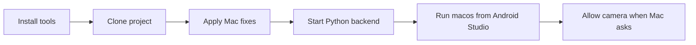

# MacBook setup for ELIXR (beginner guide)

## What you are building

ELIXR has **two parts** that must run at the same time:

| Part     | What it is            | What it does                                     |
| -------- | --------------------- | ------------------------------------------------ |
| Backend  | A small Python server | Opens the webcam and scores your practice        |
| Frontend | A Flutter desktop app | The screens you click (login, practice, history) |

On Windows you ran the Flutter part as a Windows app. On your MacBook you will:

- Edit/run from **Android Studio** (your code editor)
- Still launch the app as a **macOS** app (not an Android phone emulator)

Think of it like this: Android Studio is the workshop; **macos** is the device you build for.



**Success looks like:** backend health check works → Flutter window opens → Practice/Camera Test uses the live camera (not a “demo / offline” message).

---

## Part A — On your current Windows PC (before cloning on Mac)

Do this so the Mac gets a complete project.

1. Open your project in Cursor / your usual Git tool.
2. Make sure your latest code is **pushed to GitHub** (source folders like `lib/`, `backend/`, `macos/`, `pubspec.yaml`).
3. You do **not** need to push:

- Windows build folders
- Python virtual environments (`venv`, `elixr-venv`)
- Secrets / passwords

1. After the two Mac code fixes (Part C) are done and committed, push those too so the Mac clone already includes them.

**You’ll know this worked when:** GitHub shows your latest commits on the branch you plan to clone.

---

## Part B — Install tools on the MacBook (do this once, in order)

Take your time. Finish each step before the next. Using Terminal is normal—copy/paste the commands.

### B1. Install Xcode (required for macOS apps)

1. Open the **App Store** → search **Xcode** → Install (large download; can take a while).
2. Open Xcode once and accept the license if asked.J
3. Open **Terminal** (Spotlight → type `Terminal`) and run:

```bash
sudo xcode-select --switch /Applications/Xcode.app/Contents/Developer
sudo xcodebuild -runFirstLaunch
```

Enter your Mac password when asked (you will not see characters while typing—that is normal).

**You’ll know this worked when:** those commands finish without errors.

### B2. Install Android Studio (your editor)

1. Download and install [Android Studio](https://developer.android.com/studio), **or** in Terminal:

```bash
brew install --cask android-studio
```

(If `brew` is unknown, install Homebrew first from [brew.sh](https://brew.sh)—follow their one-line install, then retry.)

1. Open Android Studio.
2. Go to **Plugins** (or Settings → Plugins).
3. Search **Flutter** → Install → also accept **Dart** when prompted → Restart Android Studio.

You do **not** need to create an Android phone emulator for ELIXR.

**You’ll know this worked when:** Android Studio opens and the Flutter plugin is installed.

### B3. Install Flutter and Python

In Terminal:

```bash
brew install --cask flutter
brew install python@3.12
```

Then point Android Studio at Flutter:

1. Android Studio → **Settings** (or Preferences) → **Languages & Frameworks** → **Flutter**
2. Set **Flutter SDK path** to your Flutter install
3. Tip: in Terminal run `which flutter` and use the folder that contains that `flutter` binary (often under Homebrew)

Enable desktop Mac builds and check your setup:

```bash
flutter config --enable-macos-desktop
flutter doctor
```

Read `flutter doctor` like a checklist. Fix anything marked with an **X** for **Xcode** / **Flutter** / **Android toolchain**.  
Ignore “no devices” or emulator warnings for now—you will use **macos**, not a phone.

**You’ll know this worked when:** `flutter doctor` looks mostly green for Xcode and Flutter.

### B4. Download (clone) the project from GitHub

```bash
git clone <paste-your-GitHub-repo-URL-here>
cd elixr_application
```

Replace the URL with your real repo link (GitHub → green **Code** → copy HTTPS).

Open it in Android Studio:

1. **Open** → choose the folder that contains `pubspec.yaml` (the project root)
2. Click **Trust Project** if asked
3. Wait for indexing / `pub get` to finish

**You’ll know this worked when:** you see folders like `lib`, `backend`, and `macos` in the Project panel.

---

## Part C — Two Mac fixes (do once; needed so camera + live practice work)

These are small code changes. They exist because some settings were written for Windows only.

### Fix 1 — Camera open code (Windows DirectShow)

**Problem in simple words:** Windows uses a camera method called DirectShow. Mac does not. Two backend files still ask for DirectShow first.

**Files to change:**

- `[backend/assessment/live_session.py](backend/assessment/live_session.py)` — function `_open_camera`
- `[backend/mock_stream.py](backend/mock_stream.py)` — function `_open_camera`

**What to do:** Match the pattern already used in `[backend/vision/camera.py](backend/vision/camera.py)`:

- On Windows (`os.name == "nt"`): try DirectShow, then fallbacks
- On Mac: open the camera with the default method only

### Fix 2 — Let the Flutter Mac app talk to the backend

**Problem in simple words:** macOS sandboxes the app. Without permission, it cannot connect to `localhost` (your Python server).

**Files to change:**

- `[macos/Runner/DebugProfile.entitlements](macos/Runner/DebugProfile.entitlements)`
- `[macos/Runner/Release.entitlements](macos/Runner/Release.entitlements)`

**Add this key** (same idea as allowing Wi‑Fi for an app):

```xml
<key>com.apple.security.network.client</key>
<true/>
```

No new packages. Do **not** change the root README for this task.

**You’ll know this worked when:** after Fix 1 + 2, Practice/Camera Test does not fail immediately with camera unavailable or constant “backend disconnected” while uvicorn is running.

---

## Part D — Every time you want to use ELIXR on Mac

You need **two running processes**: backend first, then the Flutter app.

### D1. Start the backend (Python)

Open a Terminal (Android Studio’s terminal is fine) and run:

```bash
cd backend
python3 -m venv ~/elixr-venv
source ~/elixr-venv/bin/activate
pip install -r requirements.txt
uvicorn main:app --host 127.0.0.1 --port 8000
```

Notes for beginners:

- First time: `pip install` can take several minutes and may download AI model files—keep Wi‑Fi on
- Leave this Terminal window **open**. If you close it, the camera server stops
- Your prompt may show `(elixr-venv)` when the virtual environment is active—that is good

Check it worked (new Terminal tab):

```bash
curl http://127.0.0.1:8000/health
```

**You’ll know this worked when:** you get a healthy JSON/text response (not “connection refused”).

### D2. Start the Flutter app from Android Studio

1. At the top of Android Studio, open the **device dropdown**
2. Choose **macos** (not Chrome, not an Android emulator)
3. Press the green **Run** button

Or in Terminal, from the project root:

```bash
flutter pub get
flutter run -d macos
```

**You’ll know this worked when:** an ELIXR window opens on your Mac.

### D3. Allow the camera (first time only)

The **Python backend** uses the webcam—not the Flutter window.

1. Start Practice or Camera Test with the backend running
2. When macOS asks for camera permission for **Terminal** or **Android Studio**, click **Allow**
3. If you clicked Don’t Allow by mistake: **System Settings → Privacy & Security → Camera** → turn it on for that app

Optional reset if it keeps failing:

```bash
tccutil reset Camera
```

Then try Practice again and accept the prompt.

---

## Quick “is it working?” checklist

1. Backend Terminal is still running `uvicorn`
2. `curl http://127.0.0.1:8000/health` succeeds
3. Flutter device is **macos** and the app window is open
4. You can log in / register and finish onboarding
5. With backend up, Practice / Camera Test is **live** (not labeled as offline demo only)

---

## Common beginner mistakes

| Mistake                                                               | What to do instead                                          |
| --------------------------------------------------------------------- | ----------------------------------------------------------- |
| Choosing an Android emulator in Android Studio                        | Choose **macos**                                            |
| Using Windows commands (`Scripts\activate`, `flutter run -d windows`) | Use `source ~/elixr-venv/bin/activate` and `-d macos`       |
| Starting Flutter before the backend                                   | Start `uvicorn` first, then Run                             |
| Closing the backend Terminal                                          | Keep it open while practicing                               |
| Expecting Flutter to open the camera                                  | Backend opens the camera; allow permission for that process |
| Skipping Xcode because “I’m using Android Studio”                     | Xcode is still required to build the macOS app              |

## Extra tips (only if needed)

- Built-in Mac camera is usually index `0` in `[backend/config.py](backend/config.py)`
- UI-only testing without live CV: `export ELIXR_USE_MOCK=1` before starting uvicorn (demo only—not real assessment)
- If `pip install` fails on Apple Silicon, try another Python 3.10–3.12 version from Homebrew rather than adding random packages

## Out of scope (on purpose)

- Updating the project README
- Making an Android phone/emulator the main ELIXR target
- Calling Mac an official supported product platform
- iPhone builds
